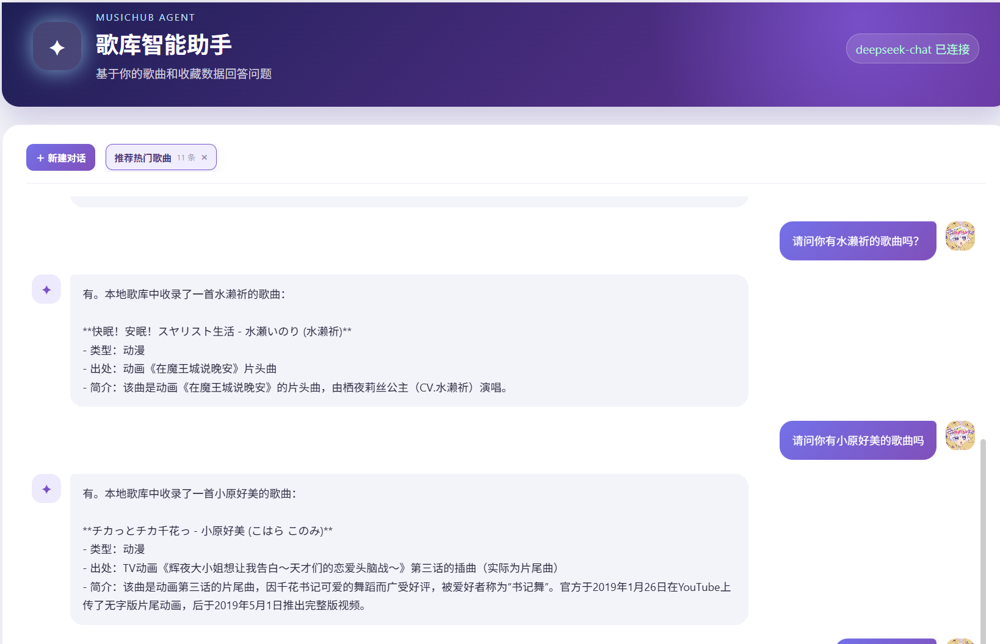
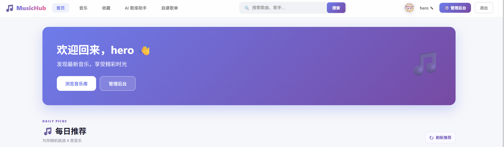

# MusicHub：智能音乐管理与混合 RAG 歌库助手

MusicHub 是一个集音乐管理、在线播放、个性化推荐和 AI 歌库问答于一体的全栈音乐系统。项目不是简单地把问题直接发送给大模型，而是先检索本地歌库数据，再通过融合、重排和事实校验生成可解释的回答。

## 技术架构

| 模块 | 主要技术 | 作用 |
| --- | --- | --- |
| 前端 | Vue 2、Vue Router、Axios、原生 CSS | 用户端、播放器、AI 助手和管理后台 |
| Java 后端 | Spring Boot、Spring MVC、MyBatis、JWT、Maven | 业务接口、认证、文件管理和推荐逻辑 |
| 数据库 | MySQL 8 | 用户、歌曲、收藏、评论、歌单、播放记录和 AI 会话 |
| 向量服务 | Python 3.10、FastAPI、Sentence Transformers、FAISS | 歌曲向量化和语义检索 |
| Agent 服务 | Python 3.10、FastAPI、LangChain、LangGraph | 统一模型协议和可扩展 AI 工作流编排 |
| Agent 记忆 | MySQL 会话状态、短期消息窗口、摘要压缩、长期偏好 | 支持多轮状态、Token 控制和服务重启后的会话恢复 |
| Agent 策略层 | LangGraph、StrategyRouter、Direct、ReAct | 按问题复杂度选择单工具直达或多轮工具推理 |
| Agent 工具层 | Pydantic、JSON Schema、ToolRegistry、ToolExecutor | 统一注册、权限检查、超时重试、熔断和标准化工具结果 |
| 嵌入模型 | `intfloat/multilingual-e5-small` | 中文、日文和英文歌曲元数据向量化 |
| 大语言模型 | DeepSeek OpenAI 兼容 API | 根据本地证据组织自然语言回答 |
| 混合检索 | SQL、关键词 RAG、向量 RAG、加权 RRF | 精确检索、语义召回、融合和去重 |
| 二阶段排序 | Metadata Rerank | 结合歌名、歌手、类型、出处和简介重新排序 |
| 回答治理 | 实体校验、低置信度拒答、动态证据预算 | 降低误召回、答非所问、无关证据和模型幻觉 |
| 检索评测 | Hit@K、Recall@K、MRR、Top-1、拒答准确率 | 量化检索、排序和拒答效果 |
| 成本评测 | 模拟/真实 Token、模型绕过率、费用估算 | 评估动态证据压缩和本地路由的成本收益 |
| 部署 | Docker Compose、Nginx | 编排 Vue、Spring Boot、MySQL、向量服务和 Agent 服务 |

### 服务拓扑

```text
浏览器
  │
  ▼
Vue 2 前端（8081）
  │ /api
  ▼
Spring Boot 业务与 AI 网关（8082）
  ├── MySQL（3306）
  ├── Local Vector RAG（8090）
  └── LangGraph Agent Service（8100）
          ├── StrategyRouter ──▶ DirectStrategy / ReActStrategy
          ├── ToolRegistry
          ├── 5 个只读工具 ──内部接口──▶ Spring Boot
          │
          └── DeepSeek OpenAI 兼容 API
```


## AI 调用链

```text
用户问题
   ↓
Vue AI 歌库助手
   ↓
Spring Boot 意图识别与实体解析
   ↓
类型与实体硬约束 → SQL 精确检索 + 关键词检索 + FAISS 向量检索
   ↓
加权 RRF 融合去重 → 元数据 Rerank → 置信度与实体校验
   ↓
按意图动态压缩的本地证据 + 历史对话 + 当前歌曲上下文
   ↓
LangGraph Agent Service（统一协议）
   ↓
DeepSeek 组织回答；Agent Service 不可用时临时直连 DeepSeek
   ↓
直连仍失败时，明确提示并使用经过约束的 Java 本地回答
   ↓
面向用户的纯文本回答 + 歌曲卡片
```


## 相比类似项目的优势

### 1. 不只是直接调用大模型

普通 AI 音乐项目通常直接让大模型回答，容易脱离本地歌库。MusicHub 先从 MySQL 和向量索引中检索真实歌曲，再让 DeepSeek 基于证据生成回答。歌曲是否收录、歌手、类型和出处等事实由本地业务数据决定。

### 2. 同时支持精确查询和模糊语义

- SQL 负责歌名、歌手、类型和出处等明确事实。
- 关键词检索负责同义词、别名和字段包含关系。
- 向量 RAG 负责“轻松的动漫歌”“类似某首歌”等模糊问题。
- 加权 RRF 将多路结果融合，并按歌曲 ID 去重。


相比只使用关键词或只使用向量数据库的项目，该方案兼顾事实准确性和语义召回能力。

### 3. 具备完整的结果治理链路

系统在召回后继续执行元数据 Rerank、实体存在性校验和低置信度拒答。明确歌名、歌手或作品不存在时，不允许向量相似度覆盖事实判断；证据不足时主动拒答，而不是强行生成内容。

### 4. 推荐结果结合真实用户行为

推荐逻辑综合收藏、播放次数、歌曲类型、收藏热度和上传时间。收藏歌曲用于建立偏好画像，但会从新的推荐候选中排除；用户提出“换一批”时，系统还会排除上一轮已经推荐的歌曲。

推荐回答与前端歌曲卡片使用同一次候选查询，不再分别执行两次推荐。系统会解析用户要求的歌曲数量；候选不足时返回实际可推荐的全部歌曲，并说明请求数量、实际数量、同类型收藏排除数量或证据不足原因，不会为了凑数加入已收藏或不符合条件的歌曲。

### 5. 对话和歌曲上下文可持久化

AI 会话、消息和当前歌曲上下文保存在 MySQL。用户重新登录或从播放器返回后仍可继续原对话，并可以创建、切换和删除会话。系统可以结合历史消息理解“这首歌”“还有别的吗”等上下文指代。

### 6. 用户可控的语义长期记忆与治理

Agent 会从“我喜欢”“我不喜欢”“不要推荐”等稳定表达中提取偏好，调用本地嵌入模型生成向量，并按当前问题的语义相关性召回少量记忆。“摇滚、摇滚乐、Rock”等同义表达会归一到同一主题，“我不喜欢摇滚、爵士和电子乐”等组合表达会拆成独立记忆。“请推荐几首、你能帮我找”等请求尾句不会写入偏好，“我喜欢什么歌曲、你知道我喜欢动漫歌曲吗”等疑问表达也会被过滤。系统会合并重复偏好；同一主题出现相反偏好时，较新的记忆替代旧记忆；“喜欢摇滚，但不喜欢日系摇滚”这类更细的例外会同时保留。明确为“本周、接下来一周”的偏好带有有效期，过期后停止召回，但仍可在记忆管理中查看和一键重新启用。

用户可以在 AI 助手页面查看记忆状态、有效期和使用次数，也可以修改、删除、清空或关闭长期记忆；密码、密钥、证件号码、联系方式和地址等敏感信息不会写入长期记忆。关闭长期记忆不影响当前对话记录。

长期记忆保存在本地 MySQL，向量由本地 RAG 服务生成。需要调用外部模型时，被召回的少量相关偏好可能随问题上下文发送给当前配置的模型服务。

记忆采集已经从模型调用中独立出来。无论问题最终由 Java 本地逻辑、Agent Service 还是 DeepSeek 回答，每条成功处理的用户消息都会进入统一采集入口。采集过程使用用户消息 ID 保证幂等，重复请求不会产生重复记忆；关闭长期记忆后，新的消息不会写入偏好库。

### 7. 统一的 Agent 工具注册与调用

Agent Service 已建立 `ToolRegistry` 和独立的 `ToolExecutor`。工具参数由 Pydantic 定义并自动生成 JSON Schema；每次调用统一经过参数校验、用户权限检查、超时、只读工具有限重试、按工具隔离的熔断以及标准化结果转换。重试只处理明确标记为可重试的网络、超时或下游服务错误；参数错误、权限错误和未知异常不会盲目重试，写工具默认禁止自动重试。熔断进入恢复窗口后只放行一次半开探测，成功后恢复调用。审计日志只记录工具名、`traceId`、耗时、尝试次数和错误码，不记录查询正文或用户数据。

LangGraph 可以根据模型返回的工具调用进入工具节点，执行完成后再把结构化结果交给模型组织最终回答，并限制单次请求的最大工具轮数。

当前已注册 `song_search`、`favorite_search`、`recommend_songs`、`vector_search` 和 `song_detail` 五个只读工具。歌曲搜索和详情以 MySQL 真实数据为准；收藏查询只使用服务端传入的当前用户身份；推荐复用现有个性化推荐、类型/听感过滤和候选排除逻辑；向量检索复用本地 FAISS 语义索引，并支持限定候选歌曲 ID。所有工具通过带版本号的内部协议调用 Spring Boot，只返回歌曲 ID、歌名、歌手、类型、出处、简介、收藏数、封面及必要检索证据，不向 Agent 暴露本地音频保存路径。内部接口可通过 `AGENT_TOOL_KEY` 配置服务间鉴权，请求上下文中的 `requestId`、`traceId` 和用户身份由服务端传递，不采信模型生成的身份信息。

### 8. Direct 与 ReAct 推理策略

Agent Service 已实现 `StrategyRouter`、`DirectStrategy` 和 `ReActStrategy`。Java 客户端默认请求 `auto`：单步骤收藏、推荐、歌曲详情或检索问题由 Direct 策略直接生成一个结构化工具调用，再让模型基于结果生成回答，省去一次模型选工具调用；包含比较、分析或多个工具意图的问题进入 ReAct，允许模型根据工具观察结果继续处理，工具轮数由成本预算限制。Java 已经准备本地证据时固定使用 Direct 且禁用工具，避免重复检索。

接口仍支持显式指定 `direct` 或 `react`。响应返回实际采用的 `strategy` 和不包含隐藏思维链的 `strategyReason`，日志只记录请求策略、最终策略、原因码和 `traceId`。

策略路由支持 `low`、`standard` 和 `high` 三档成本预算。低预算强制使用单步 Direct；标准预算允许最多 3 次模型调用、2 轮及 4 次工具调用；高预算允许最多 4 次模型调用、3 轮及 6 次工具调用。每档还限制累计 Token 和总执行时间，DeepSeek 单次请求使用当前剩余时间作为超时值，并关闭 SDK 隐式重试。达到模型、工具、Token 或时间限制后不再继续推理，响应通过 `budget` 返回实际模型调用数、工具调用数、工具轮次、累计 Token、耗时和停止原因。多轮 ReAct 的 Token 会跨所有模型调用汇总，而不是只统计最终回答。

每次 Agent 执行会按 `traceId` 将策略、原因码、预算档位、模型/工具调用量、Token、延迟、停止原因和工具执行摘要保存到 MySQL。工具摘要只包含工具名、成功状态、尝试次数、耗时和错误码；审计表不保存用户问题、模型回答、工具参数、工具返回数据或隐藏思维链。审计记录默认保留 30 天，可通过 `AGENT_AUDIT_RETENTION_DAYS` 调整。`GET /v1/audit/traces/{traceId}` 可查询单次执行摘要，Spring Boot 管理接口使用 `GET /api/admin/llm-cost-evaluation/traces/{traceId}` 转发查询。审计存储故障只影响记录，不阻断正常回答。

### 9. 检索效果可以量化评估

管理后台可以维护检索测试集，并计算 Hit@K、Recall@K、MRR、Top-1 和拒答准确率，同时展示分类指标和失败案例。LLM 成本评测 V2 支持模拟或真实调用，逐题展示本地/Agent 执行路径、Direct/ReAct 策略、模型/工具/轮次、证据量、Token、延迟、预算状态和费用，并汇总本地绕过率、策略分布、P95 延迟、预算停止数和规则通过率。测试集与导出报告带有 `2.0` 版本：原有 6 题作为生产链路历史基线，新增 5 题“Agent 原生执行”题组，分别检查 `favorite_search`、`recommend_songs`、`vector_search`、`song_detail` 和 ReAct 多工具协作。原生题组直接把原始问题交给 Agent，不预先由 Java 准备证据；模拟模式只预览路由和 Direct 工具计划，真实模式才检查工具是否实际执行并产生 API 费用。原生评测不写入会话状态或长期记忆，审计仍只保存不含问题、回答和工具数据的元数据。

### 10. 本地数据与外部模型解耦

歌曲文件、用户数据、FAISS 索引和检索逻辑保存在本地。DeepSeek 只由服务端调用，API Key 不会发送到浏览器。歌库统计、收藏查询、歌手歌曲列表等问题直接由本地逻辑回答；需要模型时再按意图发送最少量证据。未配置 DeepSeek 时，系统仍可使用本地规则和检索能力。

### 11. AI 与完整音乐业务结合

系统还包含歌曲上传、封面与歌词、多类型标签、评论点赞、头像昵称、自建歌单、顺序或随机播放、每日推荐和播放统计。AI 助手直接使用这些业务数据，而不是一个与系统分离的聊天页面。


## 项目目录

```text
MusicHub
├── vue-login/              Vue 2 用户端、播放器、AI 助手和管理后台
├── springboot-web-demo/    Spring Boot 业务接口、检索与 AI 网关
├── agent-service/          FastAPI + LangChain + LangGraph + 记忆
├── rag-service/            FastAPI + Sentence Transformers + FAISS
├── evaluation/             检索与 LLM 成本评测数据和脚本
├── music/                  本地歌曲文件目录
├── docs/images/            README 截图
├── init.sql                MySQL 初始化结构和演示账号
├── docker-compose.yml      容器编排
├── start.bat               Windows 本地一键启动
└── docker-start.bat        Docker 一键启动
```

## 系统部分截图

### AI 歌库智能助手



### 首页与每日推荐



## 安装与使用

推荐使用 Docker 部署。新电脑只需要安装 Docker Desktop，不需要分别安装 JDK、Maven、Node.js、Python 和 MySQL。

### 方式一：Docker 一键部署

#### 1. 准备环境

- 安装并启动 Docker Desktop。
- 下载或克隆本项目。
- 第一次构建需要联网下载基础镜像、Python 依赖和嵌入模型。

#### 2. 创建配置文件

在项目根目录执行：

```powershell
Copy-Item .env.docker.example .env
```

编辑根目录 `.env`：

```dotenv
MYSQL_ROOT_PASSWORD=请修改为自己的数据库密码
OPENAI_API_KEY=填写自己的DeepSeek_API_Key
OPENAI_BASE_URL=https://api.deepseek.com/v1
OPENAI_MODEL=deepseek-v4-flash
```

`OPENAI_API_KEY` 可以暂时留空，此时系统仍能使用本地查询和部分规则回答。不要把真实 `.env` 上传到 GitHub。

Docker 会将根目录的 `evaluation/` 挂载到后端容器，因此检索测试集和 LLM 成本测试集都可以在管理后台新增、修改和删除，并在容器重启后保留。

#### 3. 启动系统

可以直接双击：

```text
docker-start.bat
```

也可以在项目根目录执行：

```powershell
docker compose up -d --build
```

#### 4. 访问地址

| 服务 | 地址 |
| --- | --- |
| Vue 用户端与管理后台 | `http://localhost:8081` |
| Spring Boot 后端 | `http://localhost:8082` |
| 向量服务健康检查 | `http://localhost:8090/health` |
| Agent 服务健康检查 | `http://localhost:8100/health` |


### 方式二：本地开发环境运行

#### 1. 环境要求

- JDK 8
- Maven 3.6+
- Node.js 16+
- Python 3.10
- MySQL 8

#### 2. 初始化数据库

启动 MySQL，在项目根目录执行：

```powershell
mysql -u root -p < init.sql
```

默认数据库名称为 `springweb_demo`。Java 后端支持通过环境变量覆盖连接信息：

```properties
MUSICHUB_DB_URL=jdbc:mysql://localhost:3306/springweb_demo
MUSICHUB_DB_USERNAME=root
MUSICHUB_DB_PASSWORD=数据库密码
```

#### 3. 配置 DeepSeek

将 `springboot-web-demo/.env.example` 复制为 `springboot-web-demo/.env`，然后填写：

```dotenv
OPENAI_API_KEY=填写自己的DeepSeek_API_Key
OPENAI_BASE_URL=https://api.deepseek.com/v1
OPENAI_MODEL=deepseek-v4-flash
```

#### 4. 启动全部服务

Windows 下可以双击项目根目录：

```text
start.bat
```

脚本会依次启动 FastAPI 向量服务、LangGraph Agent 服务、Spring Boot 后端和 Vue 开发服务器，并打开 `http://localhost:8081`。启动脚本会检查 Agent 的完整依赖并等待 `http://127.0.0.1:8100/health` 返回成功；如果 Agent 启动失败，脚本会停止后续启动并提示查看 Agent 窗口中的错误，避免系统在不知情的情况下长期使用 Java 兜底。

也可以分别运行：

```powershell
# 向量服务
cd rag-service
py -3.10 -m venv .venv
.\.venv\Scripts\python.exe -m pip install -r requirements.txt
.\.venv\Scripts\python.exe -m uvicorn app.main:app --host 127.0.0.1 --port 8090

# Agent 服务（新开一个终端）
cd agent-service
py -3.10 -m venv .venv
.\.venv\Scripts\python.exe -m pip install -r requirements.txt
.\.venv\Scripts\python.exe -m uvicorn app.main:app --host 127.0.0.1 --port 8100

# Java 后端
cd springboot-web-demo
mvn spring-boot:run

# Vue 前端
cd vue-login
npm install
npm run serve
```

## 测试

### Java 单元测试

```powershell
cd springboot-web-demo
mvn test
```

测试覆盖意图识别、氛围推荐、本地回答的统一记忆采集、严格实体检索、混合检索排序、置信度判断、类型处理，以及内部工具协议、鉴权、字段过滤和自然语言检索等逻辑。

### Agent 记忆单元测试

```powershell
cd agent-service
.\.venv\Scripts\python.exe -m unittest discover -s tests -v
```

测试同时覆盖 ToolRegistry 的 JSON Schema、重复注册保护、参数校验、超时处理、只读标记，以及 LangGraph 的模型调用—工具执行—结果回传闭环。

### MySQL 记忆集成测试

```powershell
cd agent-service
$env:AGENT_MEMORY_INTEGRATION='1'
.\.venv\Scripts\python.exe -m unittest tests.test_memory_integration -v
```


## 数据与隐私说明

- 歌曲文件、业务数据、FAISS 索引、对话状态和长期记忆默认保存在本机或用户部署的 MySQL 中。
- DeepSeek API Key 只在服务端读取，不发送到浏览器。
- 密码、密钥、Token、证件号码、联系方式、银行卡和地址等敏感表达不会写入长期记忆。
- “今天、现在、今晚、暂时”等即时偏好不会写入长期记忆；“本周、接下来一周”等明确时限偏好到期后自动停止召回。
- 用户可以查看记忆状态、有效期和使用次数，并可修改、重新启用、删除、清空或关闭长期记忆；关闭记忆不会删除当前对话记录。
- 当回答需要外部模型时，只会把回答所需的消息、本地检索证据以及少量相关偏好发送给当前配置的模型服务。实际模型服务的数据处理政策由对应服务提供方决定。

## 初始账号

| 角色 | 用户名 | 密码 |
| --- | --- | --- |
| 管理员 | `admin` | `123456` |
| 普通用户 | `user` | `123456` |

默认账号仅用于演示，正式部署前应修改密码。

## Docker 部署检查

可以在项目根目录执行以下命令检查 Compose 配置：

```powershell
docker compose config --quiet
docker compose build
docker compose up -d
docker compose ps
```

如果提示无法连接 `docker_engine`，请先启动 Docker Desktop，等待状态变为 Running 后再执行。首次构建会下载 Maven、Node、Python、MySQL、Nginx、嵌入模型及相关依赖，因此需要联网并可能耗时较长。
