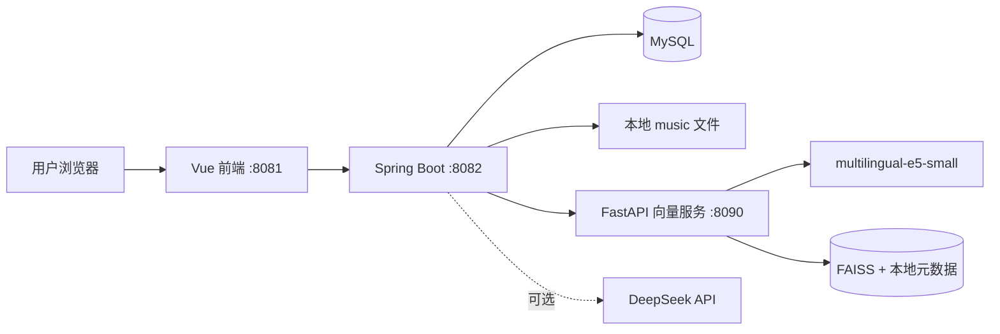

# MusicHub：本地音乐平台与混合 RAG 歌库助手

MusicHub 是一个面向本地部署的全栈音乐系统，集成音乐管理、在线播放、收藏评论、自建歌单、个性化推荐、运营统计和 AI 歌库助手。

项目采用 **Vue 2 + Spring Boot + MySQL + FastAPI + FAISS + DeepSeek**。AI 助手不是简单转发大模型 API，而是由项目自行完成意图识别、实体校验、混合检索、结果融合、重排、低置信度拒答、证据组织和会话持久化，再由 DeepSeek 根据本地证据生成自然语言回答。

## 1. 项目特点

- 完整音乐业务：上传、播放、歌词、收藏、评论、点赞、歌单和后台管理。
- 本地数据增强：歌曲事实与推荐候选均来自 MySQL 和本地向量索引。
- 混合 RAG：SQL、关键词和向量检索并行召回，再融合、去重与重排。
- 事实安全：明确歌名、歌手、作品名不存在时阻断语义兜底，避免答非所问。
- 多轮对话：会话和消息持久化，支持新建、切换、删除历史会话。
- 可量化评测：管理后台可运行 50 题测试集，展示 Hit@K、Recall@K、MRR、Top-1、拒答准确率和失败案例。
- 隐私友好：歌曲文件、数据库和向量索引保存在本机；只有最终提示词会在启用 DeepSeek 时发送给模型服务。

## 2. 系统功能

### 2.1 用户端

- 注册、登录、退出和 JWT 身份认证。
- 设置昵称、上传头像，页面优先显示昵称。
- 浏览与搜索音乐，打开播放器播放歌曲。
- 播放、暂停、进度跳转、上下首、单曲循环、顺序播放和随机播放。
- 同步歌词页面；自动切换歌曲后仍保持歌词视图。
- 收藏与取消收藏歌曲。
- 发布评论、删除自己的评论、点赞评论，并按最新或最热排序。
- 创建自建歌单、添加歌曲、删除歌曲和调整歌曲顺序。
- 在歌单范围内顺序或随机播放，离开歌单后恢复普通播放范围。
- 每日随机推荐 10 首歌曲；每天 0 点自动更新，也可手动刷新。
- 固定底部迷你播放器，可跨用户页面保持播放；进入管理后台时隐藏。

### 2.2 AI 歌库助手

- 查询歌库总量、歌曲、歌手、类型、出处和简介。
- 精确查询某位歌手、某首歌曲或某部作品对应的歌曲。
- 理解“团长那部动画”“类似某首歌”“轻松的动漫歌”等别名或模糊表达。
- 根据收藏、播放、类型偏好和歌曲元数据推荐歌曲。
- 返回歌曲卡片，可在聊天页面直接选择并播放。
- 理解“再来一些”“换一批”等上下文指令，并排除本轮已推荐歌曲。
- 保存多轮会话，重新登录后仍可查看历史记录。
- 低置信度或实体不存在时拒答，而不是返回无关歌曲。
- 回答中提供命中的本地字段和检索证据。

### 2.3 管理后台

- 用户管理：新增、编辑和删除用户。
- 音频管理：上传、删除、更换封面、修改歌名和歌手。
- 元数据管理：为一首歌设置多个类型标签，并修改出处、简介和歌词。
- 播放统计：按月份切换歌曲播放次数与近 30 天用户播放记录。
- RAG 检索评测：选择 Top-K，运行测试集并导出 JSON 报告；可在后台新增、编辑和删除测试题。
- 删除音频时清理数据库关联记录和 `music/` 中对应文件。

## 3. 技术栈

| 层级 | 技术 |
| --- | --- |
| 前端 | Vue 2.6、Vue Router、Axios、原生 CSS |
| Java 后端 | Spring Boot、Spring MVC、MyBatis、JWT、Maven |
| 数据库 | MySQL |
| 向量服务 | Python 3.10、FastAPI、Sentence Transformers、FAISS |
| 嵌入模型 | `intfloat/multilingual-e5-small` |
| 大模型 | DeepSeek OpenAI 兼容接口，可关闭并使用本地规则回答 |
| 文件存储 | 本地 `music/` 目录 |
| 容器化部署 | Docker Compose、Nginx |
| 启动环境 | Windows 本地环境，或安装 Docker Desktop 的其他电脑 |

## 4. 系统架构



### 4.1 普通业务调用链

```text
浏览器 -> Vue 页面 -> Axios -> Spring Boot Controller
       -> Service / Mapper -> MySQL 或本地文件 -> JSON 响应
```

### 4.2 AI 助手调用链

```text
用户问题
  -> 会话上下文加载
  -> 文本标准化与同义词处理
  -> 意图分类
  -> 明确实体提取与存在性校验
  -> SQL / 关键词 / 向量多路召回
  -> 融合、去重、元数据重排
  -> 低置信度判断
  -> 本地证据组装
  -> DeepSeek 生成回答或本地模板回答
  -> 消息和候选歌曲写入数据库
```

本项目属于**自研编排式 Agent**：后端根据意图选择工具和检索路径，执行固定且可解释的处理流程。它没有直接使用 LangChain、LangGraph 或 Plan-and-Execute 框架。

## 5. 混合 RAG 设计

### 5.1 歌曲文档

每首歌曲会整理为适合检索的文本，例如：

```text
歌名：Good knows
歌手：平野绫
类型：动漫
出处：动画《凉宫春日的忧郁》插曲
简介：经典校园摇滚曲目……
```

向量服务使用 `multilingual-e5-small` 将文档编码为向量并写入 FAISS；歌曲 ID 与原始证据保存在本地元数据文件中。

### 5.2 三路召回

| 检索来源 | 主要职责 | 典型问题 |
| --- | --- | --- |
| SQL | 精确事实、排序与计数 | “Ayasa 的歌有哪些”“收藏最多的三首歌” |
| 关键词 RAG | 字段包含、别名和结构化词命中 | “凉宫春日相关歌曲” |
| 向量 RAG | 模糊语义和相似表达 | “轻松的动漫歌”“类似 Good knows 的歌” |

三路结果统一转换为 `RetrievalResult`，记录歌曲 ID、检索来源、原始分数、证据内容和来源排名。

### 5.3 融合与去重

同一歌曲可能被多条检索路径命中。系统按歌曲 ID 去重，并使用加权 RRF 融合排名：

```text
融合分 = Σ 来源权重 / (60 + 当前来源排名)
```

| 意图 | SQL | 向量 | 关键词 |
| --- | ---: | ---: | ---: |
| 默认 | 3.0 | 1.5 | 1.0 |
| 事实查询 | 4.0 | 1.0 | 1.5 |
| 推荐查询 | 1.5 | 3.0 | 2.0 |

事实问题优先相信 SQL，模糊推荐更多利用向量语义，关键词召回负责补充字段与别名命中。

### 5.4 Rerank

```text
重排分 = 融合分 × 0.55
       + 元数据匹配分 × 0.35
       + 多路命中分 × 0.10
```

- **融合分**：歌曲在多条召回路径中的综合排名质量。
- **元数据匹配分**：问题与歌曲歌名、歌手、类型、出处和简介的匹配程度。
- **多路命中分**：同一歌曲同时被多个检索器命中时获得的稳定性加分。

### 5.5 实体存在性校验

向量相似并不等于事实存在。系统会识别问题中的明确约束：

- `SONG`：歌名。
- `SINGER`：歌手。
- `SOURCE`：动漫、影视或作品出处。
- `GENRE`：歌曲类型。
- `COLLECTION_COUNT`：收藏数量或收藏排序约束。

处理原则：明确实体先执行 SQL 精确或规范化匹配；若匹配为零，再检查候选歌曲对应字段。完全没有实体重合时返回空结果，不允许向量相似度覆盖事实判断。没有明确实体的开放推荐仍可正常使用向量检索。

### 5.6 低置信度拒答

```text
置信度 = 检索来源质量 × 0.45
       + 元数据匹配分 × 0.40
       + 多路命中分 × 0.15
```

| 查询类型 | 阈值 |
| --- | ---: |
| 事实查询 | 0.42 |
| 推荐查询 | 0.30 |
| 默认查询 | 0.36 |

低于阈值时系统明确说明未找到可靠结果，不让大模型编造本地歌库事实。

### 5.7 证据约束

DeepSeek 只接收经过检索、实体校验和重排后的本地证据。系统要求模型不得把常识冒充数据库事实，没有证据时必须说明未找到；推荐结果还必须对应实际歌曲 ID，前端才能渲染可播放卡片。

## 6. 检索效果评测

管理后台默认提供 50 题标准测试集，覆盖歌名歌手、出处、类型、情绪、多条件推荐、收藏、上下文指代、换一批推荐和否定事实。管理员可通过“管理测试集”和“新增测试题”维护题目，修改会持久化到 JSONL 文件。

| 指标 | 含义 |
| --- | --- |
| Hit@K | 前 K 个结果中是否至少命中一个标准答案 |
| Recall@K | 标准答案中有多少被前 K 个结果召回 |
| MRR | 第一个正确结果排名的倒数均值 |
| Top-1 准确率 | 第一名是否为标准答案 |
| 拒答准确率 | 未收录问题是否正确返回空结果 |
| 总体案例准确率 | 每道题是否满足完整判定条件 |

Top-K 越小，结果更精炼，但多答案问题的 Recall 通常会下降。例如标准答案有 5 首时，Top-K=3 最多只能召回其中 3 首；这不一定代表检索逻辑故障。应结合分类指标和失败案例区分排序问题、召回问题与测试标准问题。

测试数据位于 `evaluation/rag-eval-50.jsonl`。

## 7. 数据库设计

初始化脚本：`init.sql`。

| 表 | 用途 |
| --- | --- |
| `user` | 用户、角色、昵称和头像 |
| `audio` | 歌曲、歌手、多类型标签、出处、简介、文件和封面 |
| `user_collect` | 用户收藏关系 |
| `user_audio_play` | 每日播放记录 |
| `audio_comment` | 歌曲评论 |
| `comment_like` | 评论点赞关系 |
| `user_playlist` | 用户自建歌单 |
| `playlist_song` | 歌单歌曲与排序 |
| `assistant_conversation` | AI 会话元数据 |
| `assistant_message` | AI 多轮消息与上下文 |

## 8. 项目目录

```text
example/
├─ README.md
├─ start.bat
├─ init.sql
├─ .gitignore
├─ music/                    # 音频、封面、头像和歌词文件
├─ springboot-web-demo/      # Spring Boot 后端
├─ vue-login/                # Vue 用户端和管理后台
├─ rag-service/              # FastAPI + E5 + FAISS
└─ evaluation/               # 50 题 RAG 评测集
```

## 9. 环境要求

- Windows 10/11。
- JDK 8 或 `pom.xml` 指定的兼容版本。
- Maven 3.6+。
- Node.js 16+ 与 npm。
- Python 3.10。
- MySQL 8.x。
- 首次下载嵌入模型时需要网络，之后可离线运行向量检索。

## 10. 数据库配置

启动 MySQL，执行根目录 `init.sql`，再检查：

```text
springboot-web-demo/src/main/resources/application.properties
```

当前开发配置默认连接本地 `springweb_demo` 数据库，账号和密码通过环境变量覆盖：

```properties
MUSICHUB_DB_URL=jdbc:mysql://localhost:3306/springweb_demo
MUSICHUB_DB_USERNAME=root
MUSICHUB_DB_PASSWORD=可选，未设置时使用本地开发默认值
server.port=8082
```

不要在 `application.properties` 或公开仓库中保留真实凭据。

## 11. DeepSeek 配置

复制 `springboot-web-demo/.env.example` 为 `springboot-web-demo/.env`，不要提交真实配置：

```dotenv
OPENAI_API_KEY=填写你的_DeepSeek_API_Key
OPENAI_BASE_URL=https://api.deepseek.com/v1
OPENAI_MODEL=deepseek-chat
```

`OPENAI_API_KEY` 在本项目中保存 DeepSeek Key，因为 DeepSeek 提供 OpenAI 兼容接口。若不配置 Key，系统仍可使用本地检索和模板回答。若 Key 曾出现在聊天记录、截图或公开仓库中，应立即撤销并重新生成。

## 12. 安装依赖

前端：

```powershell
cd "C:\Users\sym20\Desktop\新建文件夹 (3)\example\vue-login"
npm install
```

Java 后端：

```powershell
cd "C:\Users\sym20\Desktop\新建文件夹 (3)\example\springboot-web-demo"
mvn clean package -DskipTests
```

向量服务：

```powershell
cd "C:\Users\sym20\Desktop\新建文件夹 (3)\example\rag-service"
py -3.10 -m venv .venv
.\.venv\Scripts\python.exe -m pip install -r requirements.txt
```

模型首次加载会下载到 Hugging Face 缓存。索引目录遇到中文路径问题时可回退到 `%USERPROFILE%\.musichub-rag-data`。

## 13. 启动项目

确认 MySQL 已启动后，双击根目录 `start.bat`。脚本会启动：

- 向量服务：`http://127.0.0.1:8090`
- Java 后端：`http://localhost:8082`
- Vue 前端：`http://localhost:8081`

等待服务就绪后会自动打开 `http://localhost:8081`。

分别启动时使用：

```powershell
# 向量服务
cd rag-service
.\.venv\Scripts\python.exe -m uvicorn app.main:app --host 127.0.0.1 --port 8090

# Java 后端
cd springboot-web-demo
mvn spring-boot:run

# Vue 前端
cd vue-login
npm run serve -- --port 8081
```

## 14. 初始账号

| 角色 | 用户名 | 密码 |
| --- | --- | --- |
| 管理员 | `admin` | `123456` |
| 普通用户 | `user` | `123456` |

仅供本地开发，部署前必须修改密码并使用安全的密码哈希方案。

## 15. Docker 一键部署

Docker 部署仍使用 Vue 前端。构建阶段由 Node.js 编译 Vue，运行阶段由 Nginx 托管静态文件并把 `/api`、`/audio` 转发到 Spring Boot。

### 15.1 发布前隐私检查

仓库已经通过 `.gitignore` 排除以下本地私有内容：

- `music/` 中的音频、封面、歌词和头像，仅保留空目录标记。
- 所有真实 `.env` 文件和 DeepSeek API Key。
- FAISS 索引、Python 虚拟环境、前端依赖和构建产物。

`init.sql` 只创建空业务表和两个演示账号，不包含本机歌曲记录。上传 GitHub 前仍应执行 `git status`，确认没有误加入媒体文件或真实密钥。

### 15.2 在新电脑启动

新电脑只需要安装并启动 Docker Desktop，然后在项目根目录执行：

```powershell
Copy-Item .env.docker.example .env
# 按需编辑 .env；OPENAI_API_KEY 可以暂时留空
docker compose up -d --build
```

Windows 也可以直接双击 `docker-start.bat`。第一次构建会下载 MySQL、Java、Node.js、Python 依赖和 `multilingual-e5-small` 模型，因此需要网络且耗时较长。启动完成后访问：

- 用户端与管理后台：`http://localhost:8081`
- Java 后端：`http://localhost:8082`
- 向量服务健康检查：`http://localhost:8090/health`

### 15.3 常用 Docker 命令

```powershell
# 查看服务状态和日志
docker compose ps
docker compose logs -f

# 停止服务，保留数据库
docker compose down

# 重新构建并启动
docker compose up -d --build

# 删除容器和数据库卷，恢复全新系统（会清空容器数据库）
docker compose down -v
```

MySQL 与 FAISS 数据使用 Docker 命名卷持久化；用户上传的文件保存在宿主机 `music/`，删除容器不会删除该目录。

## 16. 向量服务

| 方法 | 路径 | 用途 |
| --- | --- | --- |
| GET | `/health` | 检查模型和索引状态 |
| POST | `/rebuild` | 重建歌曲向量索引 |
| POST | `/search` | 返回 Top-K 歌曲 ID、分数和证据 |

健康检查：

```powershell
Invoke-RestMethod http://127.0.0.1:8090/health
```

歌曲上传、修改类型、出处、简介或删除歌曲时，Java 后端会触发索引同步；批量修改后可执行全量重建。

## 17. 常用业务接口

| 模块 | 示例接口 |
| --- | --- |
| 登录注册 | `/api/auth/login`、`/api/auth/register` |
| 音乐列表 | `/api/user/audio/list` |
| 收藏 | `/api/user/collect/**` |
| 评论 | `/api/user/audio/{audioId}/comments` |
| 歌单 | `/api/user/playlists/**` |
| AI 对话 | `/api/user/assistant/**` |
| 管理音频 | `/api/admin/audio/**` |
| 播放统计 | `/api/admin/statistics/**` |
| RAG 评测 | `/api/admin/rag-evaluation/**` |

实际请求和响应结构以 Controller 源码为准。

## 18. 验证

```powershell
# 后端测试
cd springboot-web-demo
mvn test

# 前端构建
cd vue-login
npm run build

# 向量服务测试
cd rag-service
.\.venv\Scripts\python.exe -m pytest
```

每次修改检索策略后，建议从管理后台分别运行 Top-K=3 和 Top-K=5 的 50 题评测，比较召回、排序和拒答变化。

## 19. 常见问题

### `start.bat` 一闪而过

- 确认 MySQL、Node.js、Maven、JDK 和 Python 已安装。
- 确认 `rag-service/.venv` 已创建并安装依赖。
- 检查 `8081`、`8082`、`8090` 是否被占用。
- 在 PowerShell 中运行 `start.bat`，保留窗口查看报错。

### AI 回答像本地模板

- 检查 `.env` 是否位于项目根目录。
- 检查 Key、Base URL 和模型名。
- 修改 `.env` 后重启 Java 后端。
- 通过后端日志确认 DeepSeek 请求是否成功。

### AI 查询不到类型或出处

- 确认管理后台已填写歌曲类型、出处和简介。
- 确认向量服务在线。
- 批量修改元数据后重建索引。
- 精确事实以 MySQL 为准，向量服务只补充模糊召回。

### Top-K=3 的 Recall 低于 Top-K=5

这通常是正常现象。Top-K 限制最终候选数量，多答案题在 K 较小时无法召回所有标准答案。应结合 Hit@K、MRR、Top-1 和失败案例判断。

### Docker 容器无法启动

- 执行 `docker compose ps` 检查 MySQL、RAG、后端和前端状态。
- 执行 `docker compose logs -f 服务名` 查看单个服务日志。
- 若端口冲突，在根目录 `.env` 中修改 `FRONTEND_PORT`、`BACKEND_PORT`、`RAG_PORT` 或 `MYSQL_PORT`。
- 修改 DeepSeek Key 后执行 `docker compose up -d --force-recreate backend`。

## 20. 安全与隐私

- `.env`、真实 API Key、数据库密码和用户上传文件不得提交到公开仓库。
- DeepSeek Key 只能由后端读取，不能写入 Vue 源码或返回给浏览器。
- 生产环境应限制上传类型和大小，并防止路径穿越。
- 删除歌曲会同时清理关联文件，批量操作前备份数据库和 `music/`。
- JWT 密钥、默认密码和数据库密码应改为环境变量。

---

MusicHub 的核心价值不只是“调用大模型”，而是把音乐业务数据、可解释检索、事实校验、推荐逻辑、会话记忆和评测体系组合成一个可运行、可分析、可持续优化的 AI 音乐应用。
